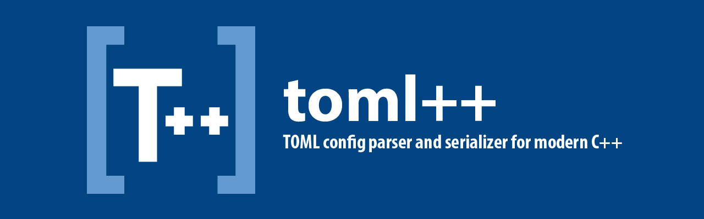

[][homepage]  
[](https://github.com/marzer/tomlplusplus/releases)
[][cpp_compilers]
[][cpp_compilers]
[][v1.0.0]
[](./LICENSE)
[](https://circleci.com/gh/marzer/tomlplusplus)
[](https://github.com/fffaraz/awesome-cpp)
====

# toml++ homepage

<p align="center">
	<strong>✨&#xFE0F; This README is fine, but the <a href="https://marzer.github.io/tomlplusplus/">toml++ homepage</a> is better. ✨&#xFE0F;</strong>
</p>

<br>

# Library features

 - Header-only
 - Supports the latest [TOML] release ([v1.0.0]), plus optional support for some [unreleased TOML language features]
 - C++17 (plus some C++20 features where available, e.g. experimental support for char8_t strings)
 - Proper UTF-8 handling (incl. BOM)
 - Works with or without exceptions
 - Doesn't require RTTI
 - First-class support for serializing to JSON
 - Tested on Clang (6+), GCC (7+) and MSVC (VS2019)
 - Tested on x64, x86 and ARM

<br>

# Basic usage

> ℹ&#xFE0F; _The following example favours brevity. If you'd prefer full API documentation and lots of specific code snippets
instead, visit the project [homepage]_

Given a [TOML] file `configuration.toml` containing the following:
```toml
[library]
name = "toml++"
authors = ["Mark Gillard <mark.gillard@outlook.com.au>"]

[dependencies]
cpp = 17
```
Reading it in C++ is easy with toml++:
```cpp
#include <toml.hpp>

auto config = toml::parse_file( "configuration.toml" );

// get key-value pairs
std::string_view library_name = config["library"]["name"].value_or(""sv);
std::string_view library_author = config["library"]["authors"][0].value_or(""sv);
int64_t depends_on_cpp_version = config["dependencies"]["cpp"].value_or(0);

// modify the data
config.insert_or_assign("alternatives", toml::array{
    "cpptoml",
    "toml11",
    "Boost.TOML"
});

// iterate & visit over the data
for (auto&& [k, v] : config)
{
    v.visit([](auto& node) noexcept
    {
        std::cout << node << "\n";
        if constexpr (toml::is_string<decltype(node)>)
            do_something_with_string_values(node);
    });
}

// re-serialize as TOML
std::cout << config << "\n";

// re-serialize as JSON
std::cout << toml::json_formatter{ config } << "\n";


```
You'll find some more code examples in the `examples` directory, and plenty more as part of the [API documentation].

<br>

# Adding toml++ to your project
`toml++` comes in two flavours: Single-header and Regular. The API is the same for both. 

### 🍦&#xFE0F; Single-header flavour
1. Drop `toml.hpp` wherever you like in your source tree
2. There is no step two

### 🍨&#xFE0F; Regular flavour
1. Add `tomlplusplus/include` to your include paths
2. `#include <toml++/toml.h>`

### Conan
Add `tomlplusplus/2.5.0` to your conanfile.

### DDS
Add `tomlpp` to your `package.json5`, e.g.:
```
depends: [
    'tomlpp^2.5.0',
]
```
> ℹ&#xFE0F; _[What is DDS?](https://dds.pizza/)_

### Vcpkg
```
vcpkg install tomlplusplus
```

### CMake FetchContent
```
include(FetchContent)
FetchContent_Declare(
    tomlplusplus
    GIT_REPOSITORY https://github.com/marzer/tomlplusplus.git
    GIT_TAG        v2.5.0
)
FetchContent_MakeAvailable(tomlplusplus)
```
> ℹ&#xFE0F; _[What is FetchContent?](https://cmake.org/cmake/help/latest/module/FetchContent.html)_

### Other environments and package managers
`toml++` is a fairly new project and I'm not up-to-speed with all of the available packaging and integration options
in the C++ ecosystem. I'm also a cmake novice, for better or worse. If there's an integration option missing be
assured that I fully support it being added, and welcome [pull requests](./CONTRIBUTING.md)!

<br>

# Configuration
A number of configurable options are exposed in the form of preprocessor `#defines`. Most likely you
won't need to mess with these at all, but if you do, set them before including toml++.

| Option                     |      Type      | Default                           | Description                                                                                                          |
|----------------------------|:--------------:|-----------------------------------|----------------------------------------------------------------------------------------------------------------------|
| `TOML_HEADER_ONLY`          |     boolean    | `1`                               | Disable this to explicitly control where toml++'s implementation is compiled (e.g. as part of a library).            |
| `TOML_API`                 |     define     | undefined                         | API annotation to add to public symbols (e.g. `__declspec(dllexport)` on Windows).                                   |
| `TOML_ASSERT(expr)`        | function macro | `assert(expr)`<br>(or undefined)  | Sets the assert function used by the library.                                                                        |
| `TOML_CONFIG_HEADER`       | string literal | undefined                         | Includes the given header file before the rest of the library.                                                       |
| `TOML_EXCEPTIONS`          |     boolean    | per your compiler's settings      | Sets whether the library uses exceptions.                                                                            |
| `TOML_IMPLEMENTATION`      |     define     | undefined                         | Define this to enable compilation of the library's implementation. Meaningless if `TOML_HEADER_ONLY` is `1`.          |
| `TOML_LARGE_FILES`         |     boolean    | `0`                               | Uses 32-bit integers for line and column indices (instead of 16-bit).                                                |
| `TOML_OPTIONAL_TYPE`       |    type name   | undefined                         | Overrides the `optional<T>` type used by the library if you need [something better than std::optional].              |
| `TOML_PARSER`              |     boolean    | `1`                               | Disable this to prevent inclusion of the parser-related parts of the library if you don't need them.                 |
| `TOML_SMALL_FLOAT_TYPE`    |    type name   | undefined                         | If your codebase has an additional 'small' float type (e.g. half-precision), this tells toml++ about it.             |
| `TOML_SMALL_INT_TYPE`      |    type name   | undefined                         | If your codebase has an additional 'small' integer type (e.g. 24-bits), this tells toml++ about it.                  |
| `TOML_UNRELEASED_FEATURES` |     boolean    | `0`                               | Enables support for [unreleased TOML language features] not yet part of a [numbered version].                        |
| `TOML_WINDOWS_COMPAT`      |     boolean    | `1` on Windows                    | Enables support for transparent conversion between wide and narrow strings in some places when building for Windows. |

> ℹ&#xFE0F; _A number of these have ABI implications; the library uses inline namespaces to prevent you from accidentally
linking incompatible combinations together._

<br>

# TOML Language Support
At any given time the library aims to support whatever the [most recently-released version] of TOML is, with opt-in
support for a number of unreleased features from the [TOML master] and some sane cherry-picks from the
[TOML issues list] where the discussion strongly indicates inclusion in a near-future release.

The library advertises the most recent numbered language version it fully supports via the preprocessor
defines `TOML_LANG_MAJOR`, `TOML_LANG_MINOR` and `TOML_LANG_PATCH`.

### 🔸&#xFE0F; **Unreleased language features:**
- [#516]: Allow newlines and trailing commas in inline tables
- [#562]: Allow hex floating-point values
- [#644]: Support `+` in key names
- [#671]: Local time of day format should support `09:30` as opposed to `09:30:00`
- [#687]: Relax bare key restrictions to allow additional unicode characters
- [#709]: Include an \xHH escape code sequence

> ℹ&#xFE0F; _`#define TOML_UNRELEASED_FEATURES 1` to enable these features (see [Configuration](#Configuration))._

### 🔹&#xFE0F; **TOML v1.0.0:**
All features supported, including:
- [#356]: Allow leading zeros in the exponent part of a float
- [#567]: Control characters are not permitted in comments
- [#571]: Allow raw tabs inside strings
- [#665]: Make arrays heterogeneous
- [#766]: Allow comments before commas in arrays

### 🔹&#xFE0F; **TOML v0.5.0:**
All features supported.

<br>

# Contributing
Contributions are very welcome! Either by [reporting issues] or submitting pull requests.
If you wish to submit a pull request, please see [CONTRIBUTING] for all the details you need to get going.

<br>

# License and Attribution

toml++ is licensed under the terms of the MIT license - see [LICENSE].

UTF-8 decoding is performed using a state machine based on Bjoern Hoehrmann's '[Flexible and Economical UTF-8 Decoder]'.

### With thanks to:
- **[@beastle9end](https://github.com/beastle9end)** - Made Windows.h include bypass
- **[@bjadamson](https://github.com/bjadamson)** - Reported some bugs and helped design a new feature
- **[@bobfang1992](https://github.com/bobfang1992)** - Reported a bug and created a [wrapper in python](https://github.com/bobfang1992/pytomlpp)
- **[@GiulioRomualdi](https://github.com/GiulioRomualdi)** - Added cmake+meson support
- **[@levicki](https://github.com/levicki)** - Helped design some new features
- **[@mosra](https://github.com/mosra)** - Created the awesome [m.css] used to generate the API docs
- **[@ned14](https://github.com/ned14)** - Reported a bunch of bugs and helped design some new features
- **[@okureta](https://github.com/okureta)** - Reported a bug
- **[@prince-chrismc](https://github.com/prince-chrismc)** - Added toml++ to ConanCenter, and fixed some typos
- **[@rbrugo](https://github.com/rbrugo)** - Helped design a new feature
- **[@Reedbeta](https://github.com/Reedbeta)** - Fixed a bug and added additional Visual Studio debugger native visualizers
- **[@Ryan-rsm-McKenzie](https://github.com/Ryan-rsm-McKenzie)** - Add natvis file to cmake install script
- **[@shdnx](https://github.com/shdnx)** - Fixed a bug on GCC 8.2.0 and some meson config issues
- **[@sobczyk](https://github.com/sobczyk)** - Reported some bugs
- **[@sneves](https://github.com/sneves)** - Helped fix a number of parser bugs
- **[@std-any-emplace](https://github.com/std-any-emplace)** - Reported some bugs
- **[@traversaro](https://github.com/traversaro)** - Added vcpkg support and reported a bunch of bugs
- **[@ximion](https://github.com/ximion)** - Added support for installation with meson
- **[@whiterabbit963](https://github.com/whiterabbit963)** - Fixed a bug with value_or conversions

<br>

# Contact
For bug reports and feature requests please consider using the [issues] system here on GitHub. For anything else
though you're welcome to reach out via other means. In order of likely response time:
- Twitter: [marzer8789](https://twitter.com/marzer8789)
- Email: [mark.gillard@outlook.com.au](mailto:mark.gillard@outlook.com.au)
- Facebook: [marzer](https://www.facebook.com/marzer)
- LinkedIn: [marzer](https://www.linkedin.com/in/marzer/)


[API documentation]: https://marzer.github.io/tomlplusplus/
[homepage]: https://marzer.github.io/tomlplusplus/
[unreleased TOML language features]: #-unreleased-language-features
[most recently-released version]: https://github.com/toml-lang/toml/releases
[numbered version]: https://github.com/toml-lang/toml/releases
[char8_t]: https://en.cppreference.com/w/cpp/keyword/char8_t
[TOML]: https://toml.io/
[TOML master]: https://github.com/toml-lang/toml/blob/master/README.md
[TOML issues list]: https://github.com/toml-lang/toml/issues
[v1.0.0]: https://toml.io/en/v1.0.0
[CONTRIBUTING]: ./CONTRIBUTING.md
[LICENSE]: ./LICENSE
[Flexible and Economical UTF-8 Decoder]: http://bjoern.hoehrmann.de/utf-8/decoder/dfa/
[cpp_compilers]: https://en.cppreference.com/w/cpp/compiler_support
[reporting issues]: https://github.com/marzer/tomlplusplus/issues/new/choose
[feature request]: https://github.com/marzer/tomlplusplus/issues/new/choose
[issues]: https://github.com/marzer/tomlplusplus/issues
[#356]: https://github.com/toml-lang/toml/issues/356
[#516]: https://github.com/toml-lang/toml/issues/516
[#562]: https://github.com/toml-lang/toml/issues/562
[#567]: https://github.com/toml-lang/toml/issues/567
[#571]: https://github.com/toml-lang/toml/issues/571
[#622]: https://github.com/toml-lang/toml/issues/622
[#644]: https://github.com/toml-lang/toml/issues/644
[#665]: https://github.com/toml-lang/toml/issues/665
[#671]: https://github.com/toml-lang/toml/issues/671
[#687]: https://github.com/toml-lang/toml/issues/687
[#709]: https://github.com/toml-lang/toml/pull/709
[#766]: https://github.com/toml-lang/toml/issues/766
[LICENSE-utf8-decoder]: ./LICENSE-utf8-decoder
[something better than std::optional]: https://github.com/TartanLlama/optional
[m.css]: https://mcss.mosra.cz/documentation/doxygen
